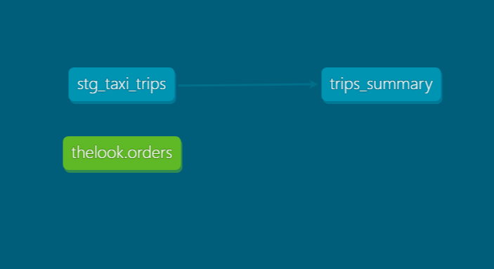

# dbt Portfolio — Chicago Taxi Trips

Analytics Engineering portfolio project built with dbt + BigQuery.

## Stack
- **dbt-core** 1.8.9
- **BigQuery** (GCP public dataset: Chicago Taxi Trips)
- **Python** 3.11 (conda environment)

## Models

| Model | Layer | Description |
|---|---|---|
| `stg_taxi_trips` | Staging | Cleans and standardizes raw Chicago Taxi data |
| `trips_summary` | Mart | Monthly trip aggregations by service provider |

## Lineage Graph (DAG)



## How to run

```bash
dbt run
dbt test
dbt docs generate && dbt docs serve
```